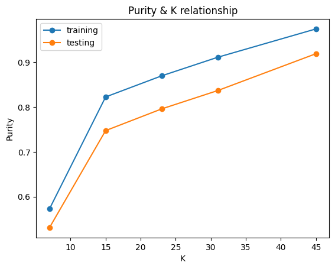
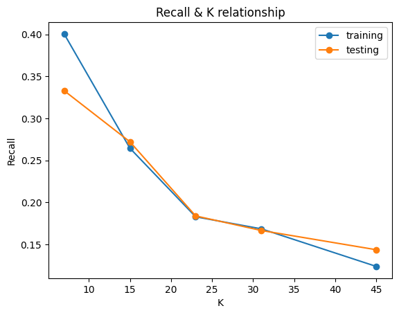
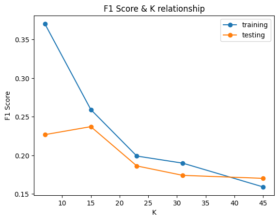
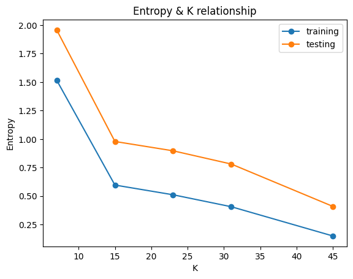

# Network-Anomaly-Detection

**Objective:** Evaluate the effectiveness of K-Means, Normalized Cut and DBSCAN algorithms for network anomaly detection in the KDD Cup 1999 dataset.

## KDD Cup 1999 Dataset:

This dataset contains a standard set of data to be audited, which includes a wide variety of intrusions simulated in a military network environment.

*   kddcup.data.gz &rarr; Full dataset
*   kddcup.data_10_percent.gz &rarr; 10 percent subset
*   corrected.gz &rarr; Test data with corrected labels

The dataset contains 42 columns (41 for features and the last one containing the labels) for the features description check [this link](https://www.researchgate.net/figure/The-41-features-provided-by-the-KDD-Cup-99-datasets_tbl1_263274883)

[KDD Cup 1999 dataset link](https://kdd.ics.uci.edu/databases/kddcup99/kddcup99.html)

[Files description source](https://www.kdd.org/kdd-cup/view/kdd-cup-1999/Data)

## Key Steps:

* **Preprocessing:**

    * Analyze and preprocess the KDD Cup dataset to convert categorical features to numerical.
 
    * Prepare data for clustering algorithms.
  
      
* **K-Means Clustering:**

    * Implement the K-Means algorithm with varying K values (7, 15, 23, 31, 45).

    * For each K, cluster the data and identify potential anomalies.

* **Normalized Cut:**

    * Due to computational limitations, create a 0.5% subset of the training data using stratified split.

    * Apply the Normalized Cut algorithm to the subset, clustering into 11 groups.

* **DBSCAN:**

    1. Firstly, We start with any data point and mark it as visited.
    2. After that we check if the point has at least min_samples in its neighborhood.
    3. If so, we start cluster creation by adding all its neighbors to a cluster. If not we mark it as a noise.
    4. For all the points we added to the cluster we checked the number of their neighbours.
    5.  If it is at least min_samples, then we add all its neighbors to the same cluster and repeat the process.
    6. If not we just add the neighbor point without its neighbors.
    7. repeat the process until all points are visited.

## Evaluation Metrics on K-Means:

* **Relation between Purity and K (Number of Neighbours):** We can see that for the purity measure as K increases the purity increases and this is because this measurement prefers clusters with no confusion and as the number of clusters increases their size decreases and also the confusion in each cluster decrease so the purity increases.

* **Relation between Recall and K (Number of Neighbours):** For the recall measure as it is the ratio between the count of labels in the cluster and the total label count, we can notice that as K increases the number of clusters increases, and their size decrease so as well the label count in each cluster will decrease so finally the average recall decrease.

* **Relation between F1-Score and K (Number of Neighbours):** As the F1-score penalizes clusters that have low recall or precision we can see that as K increases the F1-score decreases.

* **Relation between Entropy and K (Number of Neighbours):** Also from the definition of Entropy, it prefers low confusion in clusters so we can notice that because as the number of clusters increases the confusion decreases, the entropy value decreases i.e get better.

## Comparison between the clustering algorithms:

| Metric | K-Means | Normalized Cut | DBSCAN |
|---|---|---|---|
| Purity | 0.8436 | 0.9671 | 0.9995 |
| Recall | 0.2962 | 0.2624 | 0.5000 |
| F1 Score | 0.2815 | 0.3259 | 0.5956 |
| Conditional Entropy | 0.5201 | 0.1975 | 0.0058 |

**Observations:**

* DBSCAN achieves the highest purity (0.9995), indicating the best separation between normal and anomalous data points.
* DBSCAN also has the highest recall (0.5000), meaning it detects the largest proportion of actual anomalies.
* DBSCAN again leads with the highest F1 score (0.5956), suggesting a good balance between precision and recall.
* DBSCAN boasts the lowest Conditional Entropy (0.0058), implying the least uncertainty in anomaly classification.

**Key Points:**

* While DBSCAN outperforms both K-Means and Normalized Cut in most metrics, consider the following:
    * DBSCAN requires no prior assumption about the number of clusters, works with arbitrary shape data, and can detect anomalies.
    * DBSCAN requires hyperparameter tuning.
    * K-Means and Normalized Cut might be computationally faster depending on the dataset size and implementation.
